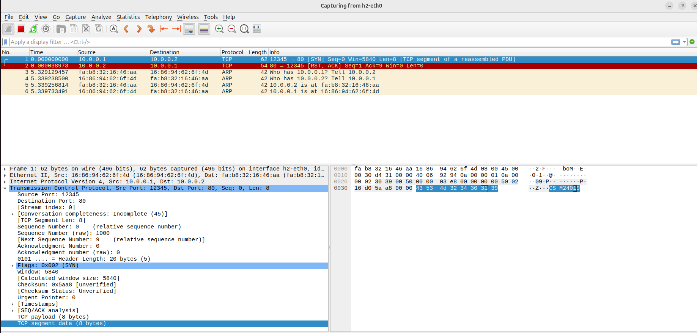
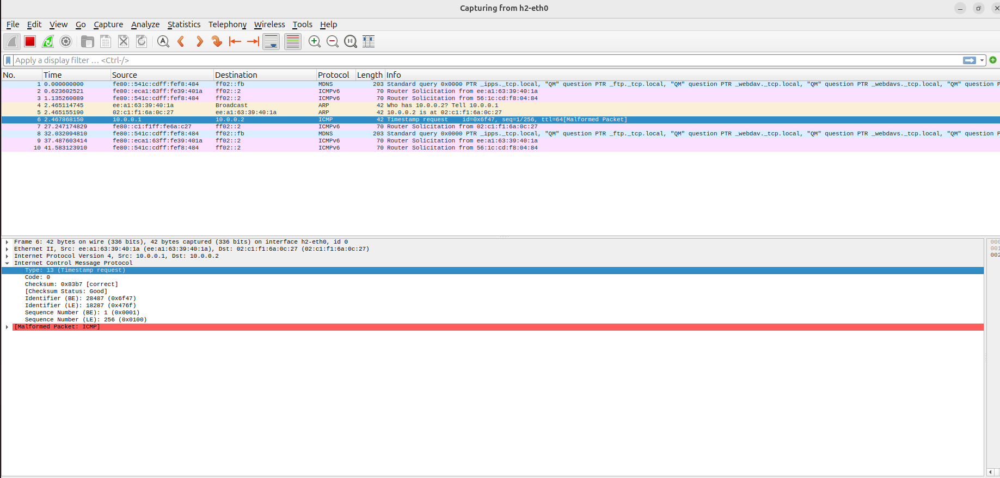

Assignment 10:

Objective:
Using RAW sockets to generate packets.

Exercise:
Write two C programs using raw socket to send i. TCP packet where TCP payload
will contain your roll number. ii. ICMP time stamp messages towards a target IP.
Steps/ Hints: (if any)

Output-

